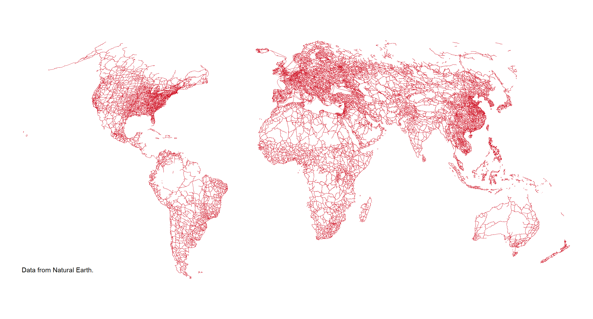

class: center, middle, hide-logo

```{r setup, include = F}
# This is the recommended set up for flipbooks
# you might think about setting cache to TRUE as you gain practice --- building flipbooks from scratch can be time consuming
options(width = 70)
knitr::opts_chunk$set(
  dev.args = list(bg = 'transparent'), 
  fig.width = 12, message = TRUE, fig.showtext = TRUE,
  warning = FALSE, comment = "", cache = TRUE, fig.retina = 3
)
par(mar = rep(0, 4), omar = rep(0,4))
knitr::opts_knit$set(global.par = TRUE)
# remotes::install_github("luukvdmeer/sfnetworks")
# remotes::install_github("EvaMaeRey/flipbookr")
library(flipbookr)
library(xaringanthemer)
library(sfnetworks)
library(sf)
library(tidygraph)
library(tidyverse)
library(TSP)
library(dbscan)
library(igraph)
```

```{r xaringan-themer, include = F}
style_mono_accent(
  # hex color should be provided, or theme_xaringan doesn't work
  base_color = '#ffa500', #orange
  title_slide_background_image = "figs/milano.png",
  background_image = "figs/milano_bg.png",
  code_font_size = '14px',
  text_slide_number_color = '#b3b3b3', #grey70
  link_color = '#ff4500', #orangered  
  footnote_font_size = '0.5em',
  footnote_position_bottom = "30px",
  code_highlight_color = "#ffedcc", #faded-orange
  extra_css = list(
    ".pull-left-70" = list("float" = "left", "width" = "65.8%"),
    ".pull-right-30" = list("float" = "right", "width" = "28.2%"),
    ".pull-left-30" = list("float" = "left", "width" = "28.2%"),
    ".pull-right-70" = list("float" = "right", "width" = "65.8%"),
    ".orange" = list("color" = "#ffa500"),
    ".note" = list("font-size" = "0.8em", "position" = "absolute", 
      "bottom" = "30px", "padding-right" = "4em")
  )
)
```

```{r color, echo = FALSE, results='asis'}
# crayon needs to be explicitly activated in Rmd
options(crayon.enabled = TRUE)
# Hooks needs to be set to deal with outputs
# thanks to fansi logic
old_hooks <- fansi::set_knit_hooks(knitr::knit_hooks,
                                   which = c("output", "message", "error"))
```

```{r ggplottheme, include = F}
library(ggplot2)
themeX = theme_set(theme_xaringan(text_font_size = 18, title_font_size = 22))
themeV = theme_set(theme_void())
theme_set(themeV)
theme_update(
  axis.ticks = element_line(color = 'grey70'),
  panel.grid = element_line(color = 'grey70', 
                            linetype = 'dotted', size = 0.5),
  legend.background = element_rect(fill = "transparent"),
  panel.background = element_rect(fill = "transparent"),
  plot.background = element_rect(fill = "transparent", color = NA)
)
```

## What are geospatial networks?

--

.pull-left[

]
--
.pull-right[

]

---
class: center, middle, hide-logo

#### Most popular spatial network analyst software?

--

## ArcGIS!


.footnote[Image © ESRI]

---
class: hide-logo

.pull-left[
## Why R then?

- Free and Open-source
- Go to Data Science coding language
- Super nice visualization libraries
- Amazing user community
]
--
.pull-right[
.center[

]
]
.footnote[
Art from [@allison_horst](https://twitter.com/allison_horst)
]
---
class: center, middle, hide-logo

## R's potential


.footnote[
Art from [@allison_horst](https://twitter.com/allison_horst)
]

---
class: center, middle, hide-logo

## Spatial Analysis in R


.footnote[
Artwork by [@allison_horst](https://twitter.com/allison_horst)
]

---
class: center, middle, hide-logo

## Network Analysis in R


.footnote[
Graphs from [R Graph Gallery](https://www.r-graph-gallery.com)
]

---
class: center, middle, hide-logo
## How to combine them?

--
.pull-left[

]
--
.pull-right[

]
--
.center[

]

---
class: center, middle
### What is the core?

> A data structure that can be provided as input to both graph analytical functions of tidygraph and to spatial analytical functions of sf, without the need for conversion. 

--

<br>

> On top of that, it contains a set of spatial network specific functions that can be used alongside the offer of the two ‘parent packages’.

---
class: center, middle

### What can we do?
---
class: middle

```{r clean1, include = F}
p1 = st_point(c(0, 1))
p2 = st_point(c(1, 1))
p3 = st_point(c(2, 1))
p4 = st_point(c(3, 1))
p5 = st_point(c(4, 1))
p6 = st_point(c(3, 2))
p7 = st_point(c(3, 0))
p8 = st_point(c(4, 3))
p9 = st_point(c(4, 2))
p10 = st_point(c(4, 0))
p11 = st_point(c(5, 2))
p12 = st_point(c(5, 0))
p13 = st_point(c(5, -1))
p14 = st_point(c(5.8, 1))
p15 = st_point(c(6, 1.2))
p16 = st_point(c(6.2, 1))
p17 = st_point(c(6, 0.8))
p18 = st_point(c(6, 2))
p19 = st_point(c(6, -1))
p20 = st_point(c(7, 1))

l1 = st_sfc(st_linestring(c(p1, p2, p3)))
l2 = st_sfc(st_linestring(c(p3, p4, p5)))
l3 = st_sfc(st_linestring(c(p6, p4, p7)))
l4 = st_sfc(st_linestring(c(p8, p11, p9)))
l5 = st_sfc(st_linestring(c(p9, p5, p10)))
l6 = st_sfc(st_linestring(c(p8, p9)))
l7 = st_sfc(st_linestring(c(p10, p12, p13, p10)))
l8 = st_sfc(st_linestring(c(p5, p14)))
l9 = st_sfc(st_linestring(c(p15, p14)))
l10 = st_sfc(st_linestring(c(p16, p15)))
l11 = st_sfc(st_linestring(c(p14, p17)))
l12 = st_sfc(st_linestring(c(p17, p16)))
l13 = st_sfc(st_linestring(c(p15, p18)))
l14 = st_sfc(st_linestring(c(p17, p19)))
l15 = st_sfc(st_linestring(c(p16, p20)))

lines = c(l1, l2, l3, l4, l5, l6, l7, l8, l9, l10, l11, l12, l13, l14, l15)

edge_colors = function(x) rep(sf.colors(12, categorical = TRUE)[-2], 2)[c(1:ecount(x))]

net = as_sfnetwork(lines)

simple = net %>%
  activate("edges") %>%
  arrange(edge_length()) %>%
  filter(!edge_is_multiple()) %>%
  filter(!edge_is_loop())

subdivision = convert(simple, to_spatial_subdivision)

smoothed = convert(subdivision, to_spatial_smooth)

# Retrieve the coordinates of the nodes.
node_coords = smoothed %>%
  activate("nodes") %>%
  st_coordinates()

# Cluster the nodes with the DBSCAN spatial clustering algorithm.
# We set eps = 0.5 such that:
# Nodes within a distance of 0.5 from each other will be in the same cluster.
# We set minPts = 1 such that:
# A node is assigned a cluster even if it is the only member of that cluster.
clusters = dbscan(node_coords, eps = 0.5, minPts = 1)$cluster 

# Add the cluster information to the nodes of the network.
clustered = smoothed %>%
  activate("nodes") %>%
  mutate(cls = clusters)

clustered = clustered %>%
  mutate(cmp = group_components())

contracted = convert(clustered, to_spatial_contracted, cls, cmp, simplify = TRUE)
```

### What can we do?

#### Network cleaning

```{r clean2, echo = F}
plot(st_geometry(net, "edges"), col = edge_colors(net), lwd = 8)
plot(st_geometry(net, "nodes"), pch = 20, cex = 4, add = TRUE)
```

---
class: middle
### What can we do?

#### Network cleaning: Simplifying edges

```{r clean3, echo = F}
plot(st_geometry(simple, "edges"), col = edge_colors(simple), lwd = 8)
plot(st_geometry(simple, "nodes"), pch = 20, cex = 4, add = TRUE)
```

---
class: middle
### What can we do?

#### Network cleaning: Subdividing edges

```{r clean4, echo = F}
plot(st_geometry(subdivision, "edges"), col = edge_colors(subdivision), lwd = 8)
plot(st_geometry(subdivision, "nodes"), pch = 20, cex = 4, add = TRUE)
```

---
class: middle
### What can we do?

#### Network cleaning: Removing pseudo-nodes

```{r clean5, echo = F}
plot(st_geometry(smoothed, "edges"), col = edge_colors(smoothed), lwd = 8)
plot(st_geometry(smoothed, "nodes"), pch = 20, cex = 4, add = TRUE)
```

---
class: middle
### What can we do?

#### Network cleaning: Simplifying intersections

```{r clean6, echo = F}
plot(st_geometry(contracted, "edges"), col = edge_colors(contracted), lwd = 8)
plot(st_geometry(contracted, "nodes"), pch = 20, cex = 4, add = TRUE)
```

---
class: middle
### What can we do?

#### Convert foreign objects: from OSM lines

```{r demo2, echo = F}
ggplot() +
  geom_sf(data = roxel)
```

---
class: middle
### What can we do?

#### Convert foreign objects: to network representations

```{r demo7, echo = F}
as_sfnetwork(roxel, directed = F) %>% 
  autoplot(net)
```

---
class: middle
### What can we do?

#### Shortest path calculations

```{r, include = F}
net = as_sfnetwork(roxel, directed = FALSE) %>%
  st_transform(3035) %>%
  activate("edges") %>%
  mutate(weight = edge_length())

net_paths = net %>% 
  morph(to_spatial_shortest_paths, 495, c(458, 121)) %>% 
  activate("nodes") %>% 
  mutate(in_path = TRUE) %>% 
  activate("edges") %>% 
  mutate(in_path = TRUE) %>% 
  unmorph() %>% 
  activate("nodes") %>% 
  mutate(in_path = replace_na(in_path, FALSE)) %>% 
  activate("edges") %>% 
  mutate(in_path = replace_na(in_path, FALSE))

# remotes::install_github('loreabad6/ggraph')
library(ggraph)
```

```{r short, include = F}
g = ggraph(net_paths, layout = 'sf') +
  geom_edge_sf(color = 'grey10') 
g1 = g + geom_sf(
    data = slice(st_as_sf(net, "nodes"), c(495, 121, 458)), 
    color = 'orange', size = 8
  )

g2 = g1 +
  geom_node_point(
    color = 'orangered', size = 4, 
    aes(filter = in_path == TRUE)
  ) +
  geom_edge_sf(color = 'orangered', size = 2, aes(filter = in_path == TRUE))
```

```{r, echo = F}
g
```

---
class: middle
### What can we do?

#### Shortest path calculations
```{r, echo = F}
g1
```

---
class: middle
### What can we do?

#### Shortest path calculations
```{r, echo = F}
g2
```

---
class: middle
### What can we do?

#### Closest facility analysis
```{r, include = F}
set.seed(128)
hull = net %>%
  activate("nodes") %>%
  st_geometry() %>%
  st_combine() %>%
  st_convex_hull()

sites = st_sample(hull, 50, type = "random")
facilities = st_sample(hull, 5, type = "random")

new_net = net %>%
  activate("nodes") %>%
  filter(group_components() == 1) %>%
  st_network_blend(c(sites, facilities))

cost_matrix = st_network_cost(new_net, from = sites, to = facilities)

# Find for each site which facility is closest.
closest = facilities[apply(cost_matrix, 1, function(x) which(x == min(x))[1])]
# Create a line between each site and its closest facility, for visualization.
draw_lines = function(sources, targets) {
  lines = mapply(
    function(a, b) st_sfc(st_cast(c(a, b), "LINESTRING"), crs = st_crs(net)), 
    sources, 
    targets, 
    SIMPLIFY = FALSE
  )
  do.call("c", lines)
}

connections = draw_lines(sites, closest)
```

```{r, echo = F}
g3 = ggraph(new_net, layout = 'sf') +
  geom_edge_sf(color = 'grey10')
g3
```

---
class: middle
### What can we do?

#### Closest facility analysis
```{r, echo = F}
g4 = g3 +
  geom_sf(data = sites, color = "orange", size = 4) 
g4
```

---
class: middle
### What can we do?

#### Closest facility analysis
```{r, echo = F}
g5 = g4 +
  geom_sf(data = facilities, color = "purple", size = 4) 
g5
```

---
class: middle
### What can we do?

#### Closest facility analysis
```{r, echo = F}
g5 +
  geom_sf(data = connections, color = "orange", size = 2, alpha = 0.7) 
```

---
class: middle
### What can we do?

#### And much more!

Some tips here to get started with the coding!

https://luukvdmeer.github.io/sfnetworks/

---
class: center, middle

# Thank you!

#### Q&A

.footnote[
Slides powered by [xaringan](https://github.com/yihui/xaringan) and [xaringanthemer](https://github.com/gadenbuie/xaringanthemer)
]
